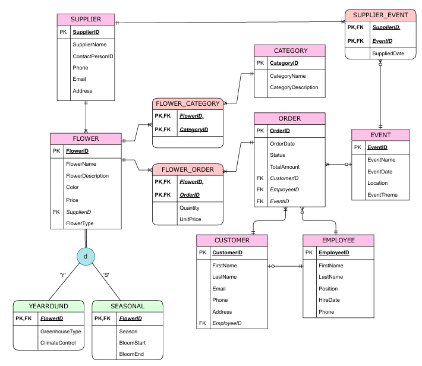

# FlowerShopBlooms Database System

A fully normalized relational database system built to manage the end-to-end 
operations of a flower shop — from inventory and supplier chains to customer 
orders and event logistics.

This project walks through the complete Database Development Lifecycle: 
conceptual modeling, logical design, normalization, physical implementation, 
and query optimization.

## Tech Stack

- **Database:** MariaDB
- **Language:** SQL

## Why This Project Matters

Understanding how data is structured, stored, and queried is foundational to 
cybersecurity. Poorly designed databases are a direct attack surface — 
vulnerable to SQL injection, privilege escalation, and data leakage. 
This project builds the ground-level fluency that informs how I approach 
database security in my work.

## ER Diagram

## Database Design Highlights

- 12 tables normalized to 3NF with no transitive or partial dependencies
- Disjoint inheritance modeled between YEARROUND and SEASONAL flower types
- Associative entities handle M:N relationships cleanly (FLOWER_ORDER, 
  FLOWER_CATEGORY, SUPPLIER_EVENT)
- Referential integrity enforced via cascading foreign keys across all tables
- Indexes added on high-frequency join and filter columns for query performance

## File Structure

| File | Description |
|------|-------------|
| `schema.sql` | Full DDL — table creation, constraints, indexes |
| `data.sql` | Sample data across all 12 entities |
| `queries.sql` | 3 composed queries using views, unions, subqueries, and aggregates |

## Security Considerations

- CHECK constraints limit input ranges and valid enum values
- Cascading deletes prevent orphaned records and referential anomalies
- VIP customer classification query filters non-seasonal flowers only, 
  demonstrating controlled data access patterns
- View-based access (loyalroselovers) demonstrates the principle of 
  least privilege at the query level
